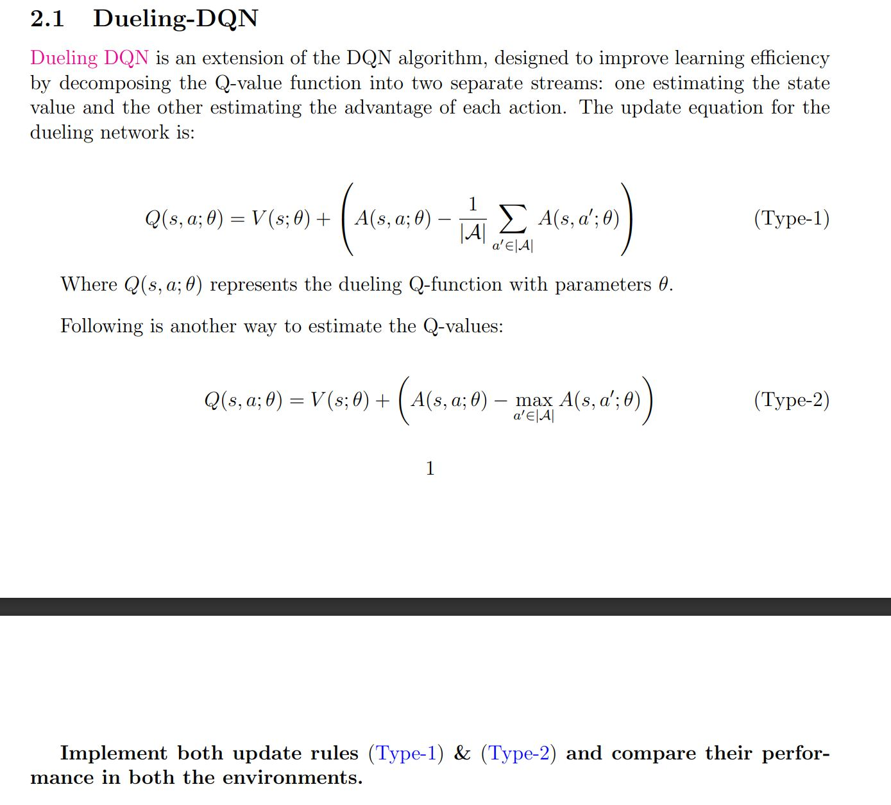
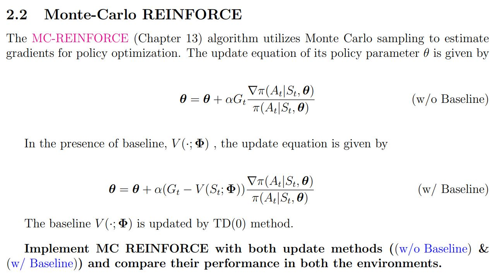
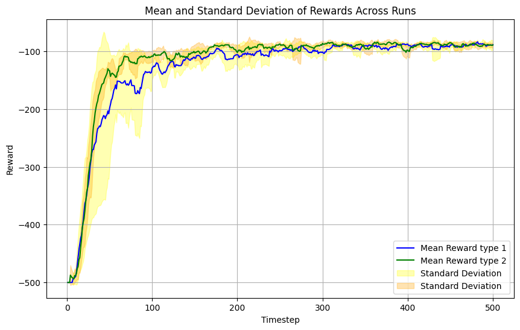
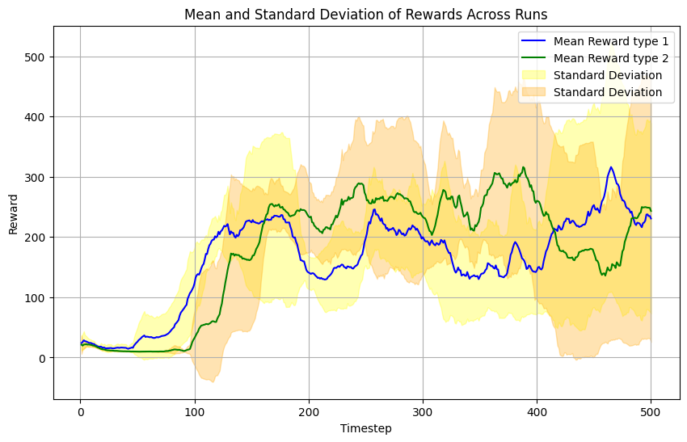
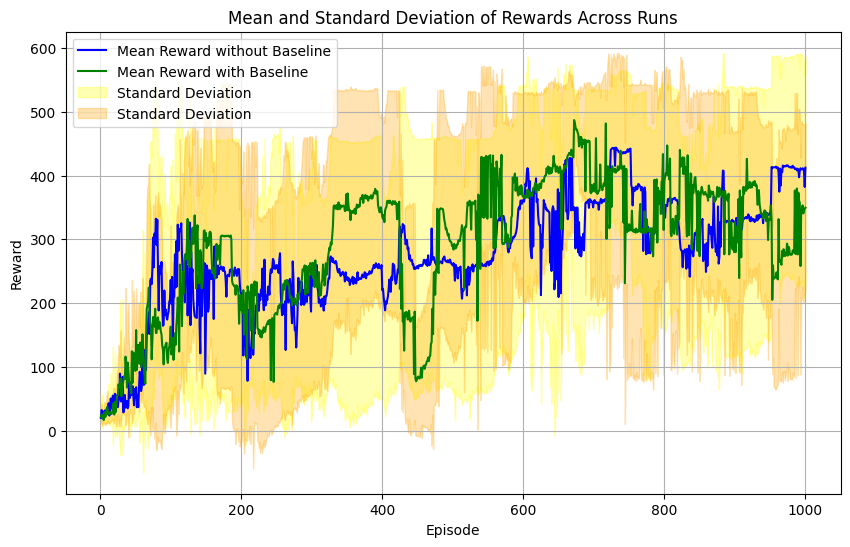

# CS6700 Programming Assignment 2: Reinforcement Learning

[](requirements.txt)

A comparative study of **Dueling-DQN** and **Monte Carlo REINFORCE** algorithms on the *Acrobot-v1* and *CartPole-v1* environments using **OpenAI Gymnasium**.

---

## 🧪 Objectives

1.  **Dueling-DQN**  
    Implement and evaluate two architectural variants of the Dueling Deep Q-Network:  
    * **Type-1**: Mean-normalized advantage  
    * **Type-2**: Max-normalized advantage  
    ➤ Compare their performance on **Acrobot-v1** and **CartPole-v1**.

2.  **Monte Carlo REINFORCE**  
    Implement and evaluate:  
    * **Without Baseline**  
    * **With Baseline** (using a learned value function as baseline, e.g., via TD(0))  
    ➤ Compare both on **Acrobot-v1** and **CartPole-v1**.

---

## 📋 Table of Contents

1.  [Overview](#📝-overview)  
2.  [Project Structure](#🗂️-project-structure)  
3.  [Environments](#🎮-environments)  
4.  [Algorithms](#⚙️-algorithms)  
5.  [Setup & Installation](#🚀-setup--installation)  
6.  [Usage](#▶️-usage)  
7.  [Results](#📊-results)  
8.  [References](#🔖-references)  

---

## 📝 Overview

This repository contains implementations (primarily notebook-based, with optional script support) of two model-free reinforcement learning algorithms:

* **Dueling-DQN**: Separates state-value and action-advantage estimation.  
* **Monte Carlo REINFORCE**: Policy-gradient trained using full episode returns, with and without a baseline.

Both are evaluated on:

* **Acrobot-v1**: Swing a two-link pendulum to a target height.  
* **CartPole-v1**: Balance an inverted pole on a cart.  

Results are averaged over 5 random seeds and shown as mean ± std dev plots.

---

## 🗂️ Project Structure
```
RL-Assignment-CS6700/
├── .gitignore
├── README.md
├── requirements.txt
├── notebooks/
│   └── rl_assignment_2_analysis.ipynb  # Main notebook for running experiments & visualization
├── src/                                # Source code (optional, if refactored from notebook)
│   ├── __init__.py
│   ├── agents/
│   │   ├── __init__.py
│   │   ├── dueling_dqn.py
│   │   └── reinforce.py
│   ├── envs/
│   │   └── __init__.py
│   ├── utils/
│   │   └── __init__.py
│   └── train.py                        # Example training script
├── results/
│   ├── plots/                          # Generated plots
│   │   ├── dueling_dqn_acrobot_comparison.png
│   │   ├── dueling_dqn_cartpole_comparison.png
│   │   ├── reinforce_acrobot_baseline_comparison.png
│   │   └── reinforce_cartpole_baseline_comparison.png
│   └── models/                         # Saved model checkpoints (optional)
├── docs/
│   ├── CS6700_PA2.pdf                  # Original assignment description
│   └── report.pdf                      # Project report PDF
└── images/
    ├── dueling_dqn_architecture.jpg    # Architecture diagram
    └── reinforce_update_rule.jpg       # Update rule diagram
```

---

---

## 🎮 Environments

| Environment     | Task Description                                     | Docs Link                                                                 |
| --------------- | ---------------------------------------------------- | ------------------------------------------------------------------------- |
| **Acrobot-v1**  | Swing a two-link pendulum to reach a fixed height.  | [Acrobot Docs](https://gymnasium.farama.org/environments/classic_control/acrobot/) |
| **CartPole-v1** | Balance an inverted pole by moving a cart left/right. | [CartPole Docs](https://gymnasium.farama.org/environments/classic_control/cart_pole/)   |

---

## ⚙️ Algorithms

### Dueling-DQN Variants

Separates Q(s,a) into V(s) + A(s,a).  


- **Type-1:** Mean-normalized advantage  
- **Type-2:** Max-normalized advantage  

### Monte Carlo REINFORCE Variants

Policy-gradient updates based on full-episode returns.  


- **Without Baseline:** Uses raw return \(G_t\).  
- **With Baseline:** Subtracts learned \(V(s_t)\) for variance reduction.

---
## 🚀 Setup & Installation

1.  **Clone the repository:**
    ```bash
    git clone https://github.com/your-username/RL-Assignment-CS6700.git
    cd RL-Assignment-CS6700
    ```

2.  **Create and activate a virtual environment (recommended):**
    ```bash
    python3 -m venv venv
    source venv/bin/activate  # On Windows use `venv\Scripts\activate`
    ```

3.  **Install dependencies:**
    ```bash
    pip install -r requirements.txt
    ```

---

## ▶️ Usage

There are two primary ways to explore this project:

**Option 1: Jupyter Notebook (Recommended)**

1.  Navigate to the `notebooks` directory:
    ```bash
    cd notebooks
    ```
2.  Launch Jupyter Lab or Jupyter Notebook:
    ```bash
    jupyter lab
    # or
    # jupyter notebook
    ```
3.  Open [rl_assignment_2_analysis.ipynb](https://github.com/ahmecse/RL-Assignments-2-IITM-CS6700/blob/main/notebooks/rl_assignment_2_analysis.ipynb) and execute the cells sequentially. This notebook contains the implementation, training loops, and plotting logic.

> **Full Report:** For detailed methodology, hyperparameter choices, and extended analysis, see the [Project Report](https://github.com/ahmecse/RL-Assignments-2-IITM-CS6700/blob/main/docs/report.pdf).

---

**Option 2: Command-Line Scripts**

```bash
# Example: Dueling-DQN Type-1 on Acrobot
python src/train.py --algo dueling_dqn --env Acrobot-v1 --variant type1 --episodes 500

# Example: REINFORCE with Baseline on CartPole
python src/train.py --algo reinforce --env CartPole-v1 --baseline True --episodes 500

**Available Flags (for `src/train.py`):**

| Flag         | Description                                      | Example          | Default     |
| :----------- | :----------------------------------------------- | :--------------- | :---------- |
| `--algo`     | Algorithm (`dueling_dqn` or `reinforce`)         | `dueling_dqn`    | `reinforce` |
| `--env`      | Gymnasium environment name                       | `CartPole-v1`    | `CartPole-v1` |
| `--variant`  | Dueling-DQN variant (`type1` or `type2`)         | `type1`          | `type1`     |
| `--baseline` | Use baseline in REINFORCE (`True` or `False`)    | `True`           | `False`     |
| `--episodes` | Number of training episodes                      | `500`            | `500`       |
| `--seed`     | Random seed for reproducibility                  | `42`             | `0`         |
```
---

## 📊 Results

Performance comparison plots (averaged over 5 seeds, showing mean ± std dev) are generated by the notebook/scripts and saved in `results/plots/`.

| Dueling-DQN (Acrobot-v1); Type-1 vs Type-2                      | Dueling-DQN (CartPole-v1); Type-1 vs Type-2                       |
| :--------------------------------------------------------------: | :----------------------------------------------------------------: |
|         |          |

| REINFORCE (Acrobot-v1); Baseline vs No Baseline                 | REINFORCE (CartPole-v1); Baseline vs No Baseline                  |
| :--------------------------------------------------------------: | :----------------------------------------------------------------: |
|  |   |

**Summary of Findings:**
- Both Dueling-DQN update rules proved effective, converging similarly on Acrobot-v1, while Type-2 showed potential for higher rewards but increased variance on CartPole-v1. 
- Adding a baseline to Monte Carlo REINFORCE dramatically improved performance and stability (reduced variance) compared to the baseline-free version across both environments, especially on Acrobot-v1.
---

## 🔖 References


1. Wang, Z., Schaul, T., Hessel, M., Van Hasselt, H., Silver, D., & de Freitas, N. (2016). *Dueling Network Architectures for Deep Reinforcement Learning*. In Proceedings of the 33rd International Conference on Machine Learning (ICML’16).  
2. Mnih, V., Kavukcuoglu, K., Silver, D., Rusu, A. A., Veness, J., Bellemare, M. G., … & Hassabis, D. (2015). *Human-level control through deep reinforcement learning*. Nature, 518(7540), 529–533.  
3. Williams, R. J. (1992). *Simple statistical gradient-following algorithms for connectionist reinforcement learning*. Machine Learning, 8(3–4), 229–256.  
4. Sutton, R. S., & Barto, A. G. (2018). *Reinforcement Learning: An Introduction* (2nd ed.). MIT Press.  
5. Gymnasium CartPole-v1 Environment. Retrieved from https://gymnasium.farama.org/environments/classic_control/cart_pole/  
6. Gymnasium Acrobot-v1 Environment. Retrieved from https://gymnasium.farama.org/environments/classic_control/acrobot/  

